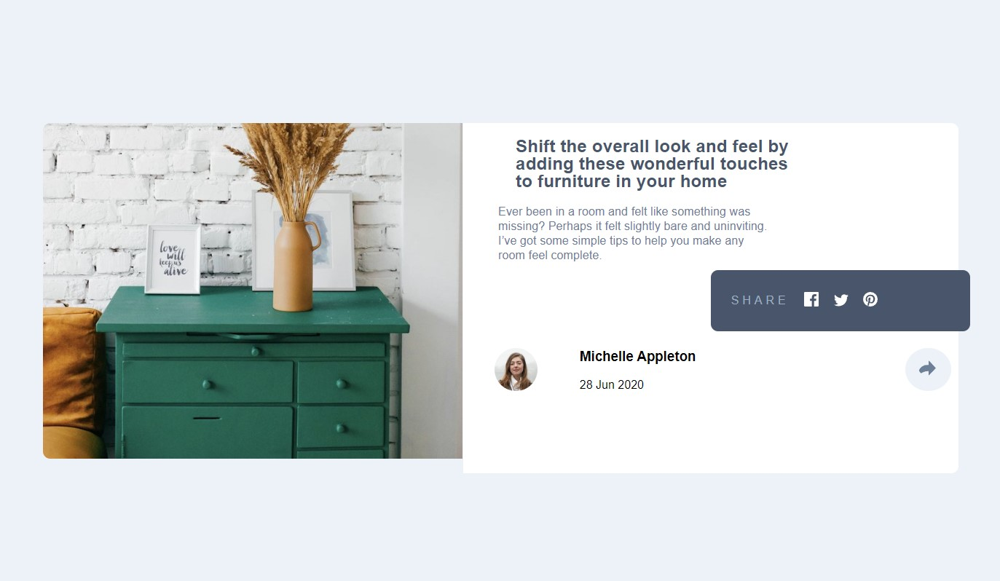

# Frontend Mentor - Article preview component solution

This is a solution to the [Article preview component challenge on Frontend Mentor](https://www.frontendmentor.io/challenges/article-preview-component-dYBN_pYFT). Frontend Mentor challenges help you improve your coding skills by building realistic projects. 

## Table of contents

- [Overview](#overview)
  - [The challenge](#the-challenge)
  - [Screenshot](#screenshot)
  - [Links](#links)
  - [Built with](#built-with)
  - [What I learned](#what-i-learned)
- [Author](#author)
- [Acknowledgments](#acknowledgments)

## Overview

### The challenge

Users should be able to:

- View the optimal layout for the component depending on their device's screen size
- See the social media share links when they click the share icon

### Screenshot

### Links

- Solution URL: [GitHub Solution Repo](https://github.com/DarkPhoenixNinja92/article-preview-component)
- Live Site URL: [GitHub Pages Site URL](https://darkphoenixninja92.github.io/article-preview-component)

### Built with

- Semantic HTML5 markup
- CSS custom properties
- Flexbox
- Mobile-first workflow
- Custom JavaScript Code

### What I learned

I did this project mainly to work on my css skills some more while adding some javascript interaction to that css in order to practice combining css classes and javascript code for a more efficient design process than merely chanaging the css with javascript.

## Author

- Website - [Shaun Pour](https://darkphoenixninja92.github.io/)
- Frontend Mentor - [@DarkPhoenixNinja92](https://www.frontendmentor.io/profile/DarkPhoenixNinja92)
- GitHub - [@DarkPhoenixNinja92](https://github.com/DarkPhoenixNinja92)

## Acknowledgments

Tip of the hat to Jessica Chan AKA Coder Coder, Garret "SelfTaughtDev", Tim Ruscica "Tech With Tim", and Tom Jackson "Code Creative". Your excellent video tutorriaals helped me keep inspired to push forward and keep lleaarrning even when it seems like my goal of becoming a professional web developer was out of reach. Cheers and thank you!